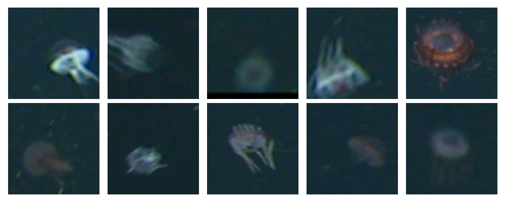

[](http://www.mbari.org)
[](https://www.python.org/downloads/)

*bio-ai* is a command line tool to run workflows for the MBARI BioDiversity project.

## Installation 

### Create the Anaconda environment

The fastest way to get started is to use the Anaconda environment.  This will create a conda environment called *bio-ai*.
```shell
git clone http://github.com/mbari-org/bio-ai.git
cd bio-ai
conda env create 
conda activate bio-ai
```

## Commands

* python bio.py download --help` - Download data for training an object detection model 
* `bio -h` - Print help message and exit.
  
## Usage

Setup a .env file with the following contents:

```ini
TATOR_API_HOST=http:/mantis.shore.mbari.org
TATOR_API_TOKEN=15afoobaryouraccesstoken
```

## Data Download

Download data for model training in a format the [deepsea-ai module expects](https://docs.mbari.org/deepsea-ai/data/) with the download command, e.g.

*If your leave off the concepts option*, the default is to fetch **all** concepts.

```shell
python bio.py download --generator vars-labelbot --version Baseline --concepts "Krill molt, Eusergestes similis"
```

Download data format is saved to a directory with the following structure e.g. for the Baseline version:

```
Baseline
    ├── labels.txt
    ├── images
    │   ├── image1.png
    │   ├── image2.png 
    ├── labels
    │   ├── image1.txt
    │   ├── image2.txt 
```
 
Once data is downloaded, split the data and continue to the [training command](https://docs.mbari.org/deepsea-ai/commands/train/). This requires setting up the AWS account.
This should be done by an AWS administrator if you are not already setup.

### PASCAL VOC data format

If you want to download data also in the PASCAL VOC format, use the optional --voc flag, e.g.

```shell
python bio.py download --generator cluster --version Baseline --concepts "Krill molt, Eusergestes similis" --voc
```

Download data format is saved to a directory with the following structure e.g. for the Baseline version:
```
Baseline
    ├── labels.txt
    ├── voc
    │   ├── image1.xml
    │   ├── image2.xml 
```
 
### COCO data format

Use the optional --coco flag to download data in the [COCO](https://cocodataset.org/#home) format, e.g.

```shell
download --generator vars-annotation --version Baseline --group MERGE_CLASSIFY --base-dir VARSi2MAP --concepts "Atolla" --coco
```

Download data format is saved to a directory with the following structure e.g. for the Baseline version:
```
Baseline
    ├── labels.txt
    ├── coco
    │   └── coco.json
```
### CIFAR data format

Use the optional --cifar flag to download data in the [CIFAR](https://www.cs.toronto.edu/~kriz/cifar.html) format, e.g.

```shell
download --generator vars-annotation --version Baseline --group MERGE_CLASSIFY --base-dir VARSi2MAP --concepts "Atolla" --cifar --voc --cifar-size 128
```

The CIFAR data is saved in a npy file with the following structure, e.g. for the data version Baseline:
```shell 

Baseline
    ├── labels.txt
    ├── cifar
    │   ├── images.npy
    │   └── labels.npy
```

Read the data (and optionally visualize) with the following code:

```python
import numpy as np
import matplotlib.pyplot as plt
images = np.load('Baseline/cifar/images.npy')
labels = np.load('Baseline/cifar/labes.npy')
 
# Visualize a few images from the CIFAR data
fig, axes = plt.subplots(nrows=2, ncols=5, figsize=(10, 4))

for i, ax in enumerate(axes.flat):
    ax.imshow(images[i])
    ax.axis('off')

plt.tight_layout()
plt.show()
```
 


## Object Detection Inference

Running a detection model that was trained with the  [deepsea-ai](https://github.com/mbari-org/deepsea-ai) module.
Uses the FastAPI framework to serve the model.  The model is served on port 8000 by default.
See [https://github.com/mbari-org/fastapi-yolov5](https://github.com/mbari-org/fastapi-yolov5) for details on
setting up the model server.

Once that is setup, run the following command to run the detections against images served from a URL.
For example, to run detections 
 - against the model at http://fasta-fasta-1d0o3gwgv046e-143598223.us-west-2.elb.amazonaws.com/predict
 - on all images available at http://digits-dev-box-fish.shore.mbari.org:8080/Ctenophora_sp_A_aug/,
 - then store them in the CTENOPHORA_SP_A_AUG group

```shell
python bio.py detect -detect --group CTENOPHORA_SP_A_AUG --base-url http://digits-dev-box-fish.shore.mbari.org:8080/Ctenophora_sp_A_aug/ --model-url http://fasta-fasta-1d0o3gwgv046e-143598223.us-west-2.elb.amazonaws.com/predict
```
 

## Object Detection Training

Downloaded data can be used to traing an object detection model. Setup and training is simplified with the [deepsea-ai](https://github.com/mbari-org/deepsea-ai) module,
which is designed to simplify the process of training and running object detection models on AWS.
 

### Setup  

Add the appropriate AWS credentials to your environment using the aws command line tool, e.g. to setup a profile specific to this project, e.g. 901103-bio

```
pip install awscli
pip install deepsea-ai
aws configure --profile 901103-bio
``` 

Then follow the [installation](https://docs.mbari.org/deepsea-ai/) instructions to prepare for training.

### Train a model

Train a model by first splitting the data first, e.g.

**Note** this will randomly split 85% of the data for training, 10% for validation and 5% as a hold out for testing.

```shell
deepsea-ai split --input Baseline --output BaselineSplit
```

Then train the model

```shell
deepsea-ai train --images BaselineSplit/images.tar.gz  --labels BaselineSplit/labels.tar.gz --model yolov5x --epochs 50 --labels labels.txt --instance-type ml.p3.16xlarge  --batch-size 32 --input-s3 901103-bio-data --output-s3 901103-bio-ckpt
```
